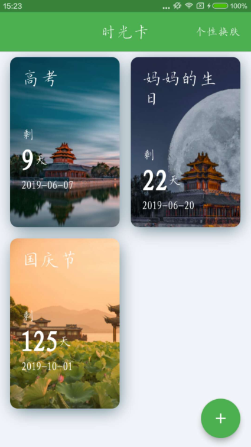
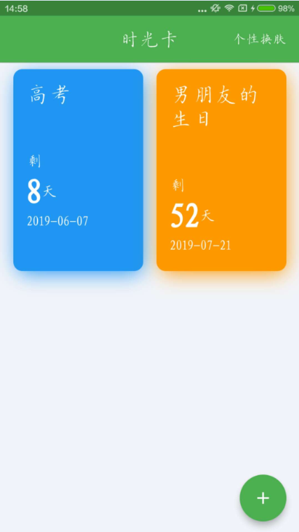
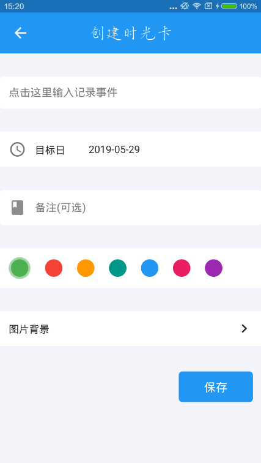
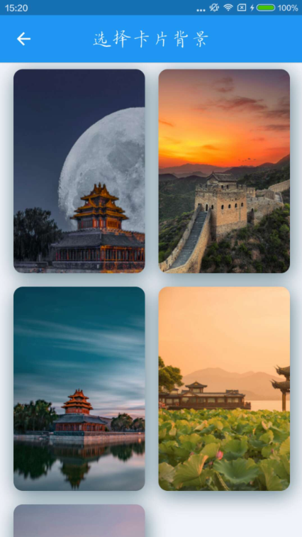

# 时光Lite

项目的状态管理是BLoC+RxDart，包括主题换肤、数据刷新渲染；所有数据都是本地处理，数据库用的sqflite，所以本项目暂时还没有用到网络这一块。

## apk下载地址：
https://www.pgyer.com/grace_day

## 后续
1、目前第三方云数据库Bmob支持Flutter，后面会考虑把数据库放在Bmob上，这样就避免了APP被删除后重装，数据库存储的数据也被删除，另外还可以做apk的在线检测更新。

2、图片背景暂时只支持已有图片的选择，后面会支持拍照和本地相册中选择，包括APP中字体的多样选择。

## 效果图
 
 

